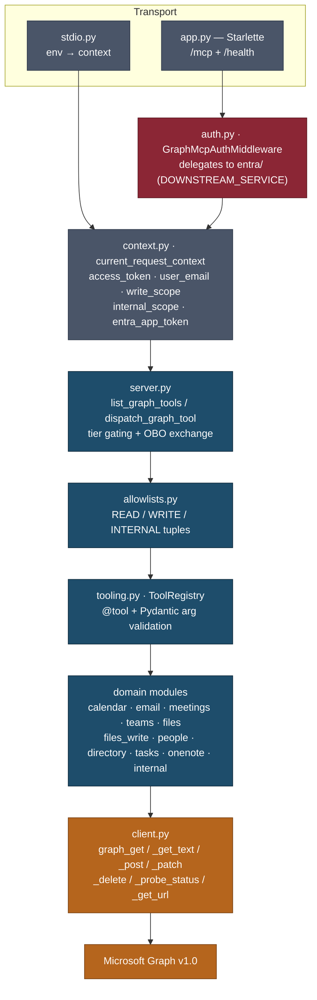

# CLAUDE.md

Guidance for Claude Code working in this repository.

`ms-graph-mcp` is a Model Context Protocol server for Microsoft Graph — 55 tools across calendar,
email, meetings, Teams, files, people, directory, tasks and OneNote, served over stdio or
Streamable HTTP. The Graph client is raw `httpx` by design: `msgraph-sdk` and `azure-identity` are
deliberately **not** dependencies (see the note at the bottom of `pyproject.toml:40`).

README.md covers the user-facing surface — install, transports, env vars, headers. This file covers
the invariants a change has to respect.

## Commits

Commits use the git user configured on the machine (`git config user.name` / `user.email`) and carry
**no tool attribution**: no `Co-Authored-By: Claude …` trailer, no `Claude-Session:` line, and no
"Generated with Claude Code" footer in PR bodies. This is a public MIT project — the history is part
of its face. Write the subject and body, then stop.

## Commands

```bash
uv sync                                    # install (uv only — no pip/poetry)
uv run pytest -q                           # full suite
uv run pytest tests/test_meetings.py -q    # one file
uv run pytest -k "write_scope" -q          # one test
uv run ruff check .                        # NB: [tool.ruff] fix = true — this rewrites files
```

`asyncio_mode = "auto"`, so async tests need no `@pytest.mark.asyncio`. `--import-mode=importlib` is
what lets `tests/test_config.py` and `tests/entra/test_config.py` coexist without `__init__.py`.

There is no typecheck step (no mypy/pyright configured) and no CI. "Verified" here means pytest
plus ruff, both green.

## Architecture

One request, top to bottom:



Every tool is `async def name(params: SomeBaseModel, context: dict)`. The `context` dict is whatever
the transport put in `current_request_context` — that ContextVar is the only channel between auth
and the tools.

## Adding a tool

Four steps. Skipping step 3 or 4 breaks the server or the suite.

1. In the domain module, define a Pydantic input model and an **async** function decorated with
   `@tool(description=...)`. A sync function raises `TypeError` at decoration time
   (`src/ms_graph_mcp/tooling.py:102`) rather than failing later inside the call loop.
2. Read the token from `context["access_token"]`. Directory *group* lookups are the exception —
   they prefer `context.get("entra_app_token")` with a fallback, because delegated permissions
   can't cover tenant-wide group reads. `tests/test_directory.py:32` asserts this by source
   inspection.
3. Add the tool name to exactly one tuple in `src/ms_graph_mcp/allowlists.py`. A registered tool
   absent from every allowlist is unreachable; an allowlist name with no registered tool raises
   `RuntimeError` out of `resolve_read_tools()` on the next `tools/list`. The server refuses to
   serve a partial surface rather than silently dropping a tool.
4. If it is a read tool, bump the hardcoded count in `tests/test_allowlists.py:28`
   (`len(READ_TOOL_NAMES) == 42`). That assertion exists so adding or removing a tool is a
   deliberate edit.

Any caller-supplied value interpolated into a Graph path or an OData `$filter` must go through
`src/ms_graph_mcp/odata.py` — `validate_graph_id`, `validate_mail_folder`, `validate_task_status`,
`escape_odata_string`. Do not hand-roll the escaping.

## The three tiers

| Tier | Count | Exposed when |
|---|---:|---|
| Read | 42 | always |
| Write | 4 | `X-Write-Scope: true` |
| Internal | 9 | shared-secret machine principal **and** `X-Internal-Scope: true` |

Security invariants — do not relax these to make something work:

- `assert_no_write_in_reads()` (`allowlists.py:125`) fails loudly if a write or internal name leaks
  into the read allowlist, or if any allowlist has duplicates.
- The internal tier gates on `principal.is_machine`, never `is_app_only`. A real Entra
  client-credentials token also sets `is_app_only`; only the shared-secret bypass sets `is_machine`
  (`entra/middleware.py:44`). This was an audited finding — see the S2 comment at `auth.py:70-78`,
  with defense in depth at `entra/middleware.py:118`.
- Dispatch fails closed. Unknown name, missing scope, and missing Graph token each return a
  structured `{"error": ..., "message": ...}` before any Graph call (`server.py:74-135`).
- `send_email` / `propose_email` check `GRAPH_MCP_SEND_EMAIL_ALLOWED_DOMAINS` before the Graph call
  (`email.py:237`), not after.
- Internal tools must never appear in `READ_TOOL_NAMES` / `WRITE_TOOL_NAMES` — that is what keeps
  them off the agent-visible `tools/list`.

## Auth postures

Selected by `GRAPH_MCP_DOES_OBO` in `config.py:125-153`:

- **Interim (default)** — the caller forwards an already-OBO'd Graph token. Validated for the Graph
  audience plus `azp == our client_id`, so only OBO tokens minted by this registration are accepted.
- **Resource server** (`mcp_does_obo=true`) — the inbound token is audienced to this MCP. Audience
  binding is the gate, so the azp check is dropped, and `server.py:143` exchanges the token via
  `obo.py` (MSAL) before the tool runs.

`src/ms_graph_mcp/entra/` is a vendored, self-contained auth toolkit running in
`AuthMode.DOWNSTREAM_SERVICE`. It has its own `tests/entra/conftest.py` with a real generated RS256
keypair and a patched JWKS client, so the actual `jwt.decode` path is exercised without network.
Extend those fixtures rather than mocking `verify_token`.

## Gotchas

- **`client.py:_build_url` does not URL-encode `$` on purpose.** Switching to httpx `params=` breaks
  every OData query (`$filter`, `$select`, …), and over-quoting double-encodes `%3a` inside
  JoinWebUrl filter values. The safe-set is tuned to match how the Graph JS SDK passes OData.
- **`graph_get()` reserves `headers=` out of `**params`.** Passing headers any other way encodes
  them into the query string and Graph silently ignores them — that is the root cause of the
  "memberOf returns 200 but typed properties are null" class of bug (missing
  `ConsistencyLevel: eventual`).
- **`graph_get_url()`'s host check is an SSRF guard**, not a formality. It is the only helper taking
  a caller-supplied full URL; without the check a bearer-token request could be redirected off-host.
- **`mcp` is pinned `>=1.9,<2.0` deliberately.** 2.x dropped the decorator registration API
  (`server.list_tools()` / `server.call_tool()`) that `server.py` uses and ships its own
  `streamable_http_app`. Upgrading means reworking `server.py` and `app.py` together.
- **The package must not import the original monorepo.** `tests/test_tools_contract.py:123` AST-walks
  every module and fails on imports of `shared`, `agents`, `integrations`, `control_plane`,
  `wg_tool_core`, `wg_service_auth`.
- **`get_config()` is a cached module singleton** and `build_app()` mutates it. `tests/conftest.py`
  resets it autouse; keep new config-touching tests within that fixture's reach.
- **`build_app()` is a factory, not a singleton** — `StreamableHTTPSessionManager.run()` may only be
  entered once per manager (`app.py:40-49`).
- `tooling.local_registry()` exists for hosting two tool packages in one process. Otherwise `@tool`
  registers into a process global.
- OpenTelemetry is API-only. Spans are no-ops unless the host process configures an SDK, so a
  standalone run needs no exporter.
