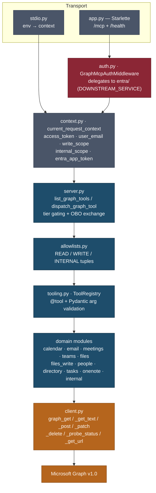

# CLAUDE.md

Guidance for Claude Code working in this repository.

`ms-graph-mcp` is a Model Context Protocol server for Microsoft Graph — 85 tools across calendar,
email, meetings, Teams chat, files, people, directory, tasks and OneNote, served over stdio or
Streamable HTTP. Tool names are namespaced by Graph permission family (`mail_`, `files_`,
`calendar_`, `meetings_`, `chat_`, `directory_`, `people_`, `tasks_`, `notes_`). The Graph client is raw `httpx` by design: `msgraph-sdk` and `azure-identity` are
deliberately **not** dependencies (see the note at the bottom of the `dependencies` block in
`pyproject.toml`, and [ADR 0002](docs/adr/0002-raw-httpx-graph-client.md)).

README.md covers the user-facing surface — install, transports, env vars, headers. This file covers
the invariants a change has to respect.

## Commits

Commits use the git user configured on the machine (`git config user.name` / `user.email`) and carry
**no tool attribution**: no `Co-Authored-By: Claude …` trailer, no `Claude-Session:` line, and no
"Generated with Claude Code" footer in PR bodies. This is a public MIT project — the history is part
of its face. Write the subject and body, then stop.

## Commands

```bash
uv sync                                    # install (uv only — no pip/poetry)
uv run pytest -q                           # full suite
uv run pytest tests/test_meetings.py -q    # one file
uv run pytest -k "write_scope" -q          # one test
uv run ruff check .                        # NB: [tool.ruff] fix = true — this rewrites files
uv run ruff format .                       # CI runs --check; keep the tree formatted
```

`tests/test_protocol_conformance.py` drives a real `mcp.Client` session against the server
in-process. That is the only place the wire protocol is actually exercised — the other tests call
handlers directly, which cannot catch a schema rejection or a silent downgrade to the legacy
protocol revision.

`asyncio_mode = "auto"`, so async tests need no `@pytest.mark.asyncio`. `--import-mode=importlib` is
what lets `tests/test_config.py` and `tests/entra/test_config.py` coexist without `__init__.py`.

There is no typecheck step (no mypy/pyright configured), so "verified" here means pytest plus ruff,
both green. CI (`.github/workflows/ci.yml`) runs exactly that on Python 3.12 and 3.13, then builds
the wheel, installs it into a clean venv, and resolves the tool allowlists from it — so a module
missing from the wheel fails the PR rather than the release.

## Architecture

One request, top to bottom:



Every tool is `async def name(params: SomeBaseModel, context: dict)`. The `context` dict is whatever
the transport put in `current_request_context` — that ContextVar is the only channel between auth
and the tools.

## Adding a tool

Five steps. Skipping 3, 4 or 5 breaks the server or the suite.

1. In the domain module, define a Pydantic input model and an **async** function decorated with
   `@tool(description=...)`. A sync function raises `TypeError` at decoration time
   (`src/ms_graph_mcp/tooling.py:102`) rather than failing later inside the call loop.
2. Read the token from `context["access_token"]`. Directory *group* lookups are the exception —
   they prefer `context.get("entra_app_token")` with a fallback, because delegated permissions
   can't cover tenant-wide group reads. `tests/test_directory.py:32` asserts this by source
   inspection.
3. Add the tool name to exactly one tuple in `src/ms_graph_mcp/allowlists.py`. A registered tool
   absent from every allowlist is unreachable; an allowlist name with no registered tool raises
   `RuntimeError` out of `resolve_read_tools()` on the next `tools/list`. The server refuses to
   serve a partial surface rather than silently dropping a tool.
4. Bump the hardcoded count in `tests/test_allowlists.py`. That assertion exists so adding or
   removing a tool is a deliberate edit rather than an accident.
5. Regenerate the docs that are derived from the code. Both are checked in CI, so a stale copy
   fails the PR rather than reaching a reader:

   ```bash
   uv run python scripts/generate_permissions.py   # docs/permissions.md, from the descriptions
   uv run python scripts/check_docs.py             # tool counts quoted in prose
   ```

   `check_docs.py` also fails when a pattern matches *nothing* — rewording a sentence it anchors on
   would otherwise leave the number silently unchecked.

Any caller-supplied value interpolated into a Graph path or an OData `$filter` must go through
`src/ms_graph_mcp/odata.py` — `validate_graph_id`, `validate_mail_folder`, `validate_task_status`,
`escape_odata_string`. Do not hand-roll the escaping.

### Tool quality rules — enforced by `tests/test_tools_contract.py`

These are tests, not preferences. An 85-tool surface only stays coherent if drift breaks the build.

- **Every tool declares annotations.** Pass one of the five presets from `tooling.py`:
  `READ_ONLY`, `WRITE_CREATE`, `WRITE_UPDATE`, `WRITE_SEND`, `WRITE_DESTRUCTIVE`. A tool that
  declares nothing gets MCP's most cautious defaults — potentially destructive, non-idempotent — so
  an unannotated read tool can make a client prompt the user before reading a calendar.
  `WRITE_SEND` is deliberately not idempotent: a retried send mails twice.
- **Descriptions are 200–400 characters.** Say what it does, when to use it, what it returns, **how
  it differs from the neighbouring tool**, and the delegated permission it needs. This is the only
  thing a model chooses by; terseness is not a token saving, it is the main cause of mis-selection.
  `people_search` / `directory_search_users` / `people_list_contacts` read three different data
  sources and are the case that most needs the differentiation.
- **Errors come from `errors.py`, never ad-hoc dicts.** `scope_denied`, `throttled`, `not_found`,
  `conflict`, `invalid_arguments`, `upstream_error`, and `graph_error_response` to map an
  `httpx.HTTPStatusError`. Every one carries `retryable`, which is what stops a model looping on a
  403. Return them — never raise: a raised exception becomes a JSON-RPC protocol error, which
  clients are told *not* to feed back to the model.
- **Renames keep the old name.** Pass `aliases=("old_name",)`. The registry indexes aliases
  separately from canonical names, so `tools/list` advertises only the canonical name while
  `tools/call` still honours the old one and logs a deprecation warning.

## The three tiers

| Tier | Count | Exposed when |
|---|---:|---|
| Read | 53 | always |
| Write | 23 | `X-Write-Scope: true`, and only when `GRAPH_MCP_READ_ONLY` is off |
| Internal | 9 | shared-secret machine principal **and** `X-Internal-Scope: true` |

Security invariants — do not relax these to make something work:

- `assert_no_write_in_reads()` (`allowlists.py:125`) fails loudly if a write or internal name leaks
  into the read allowlist, or if any allowlist has duplicates.
- The internal tier gates on `principal.is_machine`, never `is_app_only`. A real Entra
  client-credentials token also sets `is_app_only`; only the shared-secret bypass sets `is_machine`
  (`entra/middleware.py:44`). This was an audited finding — see the S2 comment at `auth.py:70-78`,
  with defense in depth at `entra/middleware.py:118`.
- Dispatch fails closed. Unknown name, missing scope, and missing Graph token each return a
  structured `{"error": ..., "message": ...}` before any Graph call (`server.py:122-189`).
- `mail_send` / `mail_forward` check `GRAPH_MCP_SEND_EMAIL_ALLOWED_DOMAINS` before the Graph call,
  not after (`email.py:319`, `email.py:664`). Those two are gated because the caller picks the
  recipients; `mail_reply` / `mail_reply_all` are not, because the thread already fixes them.
- **`GRAPH_MCP_READ_ONLY` is enforced at dispatch, not just in `tools/list`.** Hiding a tool is a
  context-efficiency measure; a caller can name any tool it likes. See ADR 0003 for why there is no
  setting that skips authentication.
- Internal tools must never appear in `READ_TOOL_NAMES` / `WRITE_TOOL_NAMES` — that is what keeps
  them off the agent-visible `tools/list`.

## Auth postures

Selected by `GRAPH_MCP_DOES_OBO` in `config.py:125-153`:

- **Interim (default)** — the caller forwards an already-OBO'd Graph token. Validated for the Graph
  audience plus `azp == our client_id`, so only OBO tokens minted by this registration are accepted.
- **Resource server** (`mcp_does_obo=true`) — the inbound token is audienced to this MCP. Audience
  binding is the gate, so the azp check is dropped, and `server.py:197` exchanges the token via
  `obo.py` (MSAL) before the tool runs.

`src/ms_graph_mcp/entra/` is a vendored, self-contained auth toolkit running in
`AuthMode.DOWNSTREAM_SERVICE`. It has its own `tests/entra/conftest.py` with a real generated RS256
keypair and a patched JWKS client, so the actual `jwt.decode` path is exercised without network.
Extend those fixtures rather than mocking `verify_token`.

## Gotchas

- **`client.py:_build_url` does not URL-encode `$` on purpose.** Switching to httpx `params=` breaks
  every OData query (`$filter`, `$select`, …), and over-quoting double-encodes `%3a` inside
  JoinWebUrl filter values. The safe-set is tuned to match how the Graph JS SDK passes OData.
- **`graph_get()` reserves `headers=` out of `**params`.** Passing headers any other way encodes
  them into the query string and Graph silently ignores them — that is the root cause of the
  "memberOf returns 200 but typed properties are null" class of bug (missing
  `ConsistencyLevel: eventual`).
- **`graph_get_url()`'s host check is an SSRF guard**, not a formality. It is the only helper taking
  a caller-supplied full URL; without the check a bearer-token request could be redirected off-host.
- **MCP SDK 2.x: protocol models expose *field names*, not aliases.** `Tool.input_schema`,
  `CallToolResult.is_error`, `ListToolsResult.ttl_ms` — `tool.inputSchema` raises `AttributeError`.
  The camelCase forms work only as *construction* keywords (`types.Tool(inputSchema=...)`) and on
  the wire. Easy to get wrong in tests, where it fails as an unrelated-looking `AttributeError`.
- **`Server.get_request_handler()` takes a method string**, not a request type —
  `get_request_handler("tools/list")`, not `get_request_handler(types.ListToolsRequest)`.
- **`streamable_http_app()` owns the app's lifespan** — it runs the session manager there. If you
  need your own lifespan, chain onto `application.router.lifespan_context`; replacing it means the
  transport never starts. See `app.py`.
- **`mcp` 2.0 runs on `httpx2`, a distribution separate from `httpx`.** Both are installed: the SDK
  uses `httpx2`, `client.py` uses `httpx`. Consolidating them is tracked separately — do not mix the
  two in one module.
- **Every third-party import must be declared in `pyproject.toml`.**
  `test_package_imports_nothing_undeclared` AST-walks the package and checks each import against
  the declared dependency list, so an undeclared one fails the build here rather than on a user's
  machine.
- **`get_config()` is a cached module singleton** and `build_app()` mutates it. `tests/conftest.py`
  resets it autouse; keep new config-touching tests within that fixture's reach.
- **`build_app()` is a factory, not a singleton** — the session manager's `run()` may only be entered
  once per manager.
- **Restore `current_request_context` by value in fixtures, not by token.** A fixture body and an
  async test run in different contexts, and `ContextVar.reset()` rejects a token minted in another
  one. See the fixture in `tests/test_protocol_conformance.py`.
- `tooling.local_registry()` exists for hosting two tool packages in one process. Otherwise `@tool`
  registers into a process global.
- OpenTelemetry is API-only. Spans are no-ops unless the host process configures an SDK, so a
  standalone run needs no exporter.
