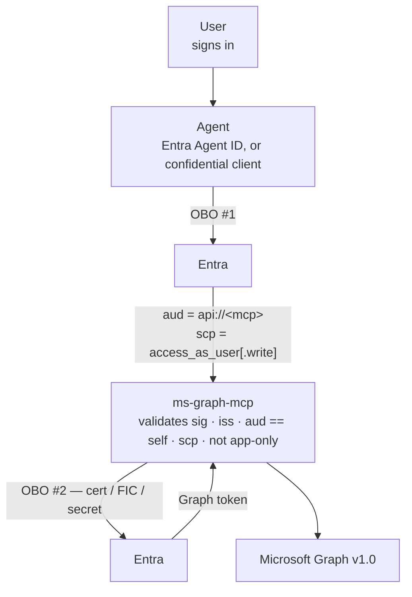

# ADR 0004 — Be an OAuth resource server by default

- **Status:** Accepted
- **Date:** 2026-09-18

## Context

Until 0.4.0 the HTTP transport's default was **token passthrough**: the caller sent a token whose
`aud` was `https://graph.microsoft.com`, and this server used it against Graph directly. The token
was validated — signature, issuer, expiry — and narrowed by checking that `azp` matched this app's
client id, so only tokens minted by this registration were accepted.

That check is not the same as the token being *for* this server. `azp` names the application that
asked for the token; `aud` names the resource it was issued to. A token audienced to Graph was
issued for Graph.

Two authorities say so directly:

- The **MCP authorization specification** requires a server to validate that a token was issued
  specifically for it, and to reject tokens that were not. It names token passthrough as an
  anti-pattern, with audience validation as the confused-deputy mitigation.
- **Microsoft's OBO documentation**: "**DO NOT** send access tokens that were issued to the middle
  tier to anywhere except the intended audience", listing among the consequences the "inability to
  satisfy token binding and Conditional Access scenarios requiring claim step-up (for example, MFA,
  Sign-in Frequency)."

That last consequence was not theoretical here. `AADSTS53003` — a Conditional Access refusal — was
already documented in this repo's troubleshooting as something users hit, and the claims challenge
that would have resolved it had nowhere to go.

The machinery for the correct posture already existed behind `GRAPH_MCP_DOES_OBO=true`. The problem
was that the default was the wrong one, and a default is what most deployments run.

## Decision

`GRAPH_MCP_DOES_OBO` defaults to **true** for the HTTP transport. The server validates that the
inbound token is audienced to itself, then performs its own on-behalf-of exchange to obtain a Graph
token. The user's token for Graph is never handed around.

Passthrough remains available as an explicit opt-in. It is deprecated, warns at startup, and is
registered for removal in 1.0.0.

The `azp` allowlist is no longer the gate — audience binding is — but it returns as an optional
second control, `GRAPH_MCP_ALLOWED_AZP`, because an Entra Agent ID token carries the agent
identity's client id there and an operator may want to name the agents allowed to call.

## Consequences

**What this buys:**

- A token issued for another resource is refused, which is what the spec requires.
- A Conditional Access step-up can complete: the exchange happens in HTTP middleware, so a claims
  challenge comes back as a `401` with `WWW-Authenticate` that a client can act on.
- Delegated scopes become meaningful. `scp` in a token audienced to this server describes what the
  user authorized *this server* to do, which is what lets the write tier be gated on
  `access_as_user.write` rather than on a header the caller sets for itself.

**What it costs, accepted knowingly:**

- **This is a breaking change for hosted deployments.** A server with `GRAPH_MCP_DOES_OBO` unset now
  needs a tenant id, a client id and a client credential, and **refuses to start** without them.
  That is deliberate: the alternative is a server that starts, passes its readiness probe and fails
  on the first tool call. Existing deployments either configure the credential or set
  `GRAPH_MCP_DOES_OBO=false` and keep working until 1.0.0.
- Callers must obtain a token audienced to this server rather than to Graph — an app-registration
  change, not a code change. See [the authentication guide](../authentication.md).
- A second hop of latency on the first tool call of a session. MSAL caches in-process, so subsequent
  calls in the same process reuse the Graph token.

**Explicitly out of scope:** stdio. A local client signs the user in interactively and already holds
a Graph token, so there is nothing to exchange. `GRAPH_MCP_DOES_OBO` is a transport setting with no
meaning there, and `tests/test_stdio_unaffected.py` enforces that it stays that way.

## References

- [MCP authorization specification](https://modelcontextprotocol.io/docs/tutorials/security/authorization)
- [OAuth 2.0 On-Behalf-Of flow — Microsoft Learn](https://learn.microsoft.com/en-us/entra/identity-platform/v2-oauth2-on-behalf-of-flow)
- [Agent OAuth flows: on-behalf-of — Microsoft Entra Agent ID](https://learn.microsoft.com/en-us/entra/agent-id/agent-on-behalf-of-oauth-flow)
- RFC 9728 (Protected Resource Metadata), RFC 8707 (Resource Indicators)
- [ADR 0003](0003-no-gateway-trust-mode.md) — token validation always runs in-server
