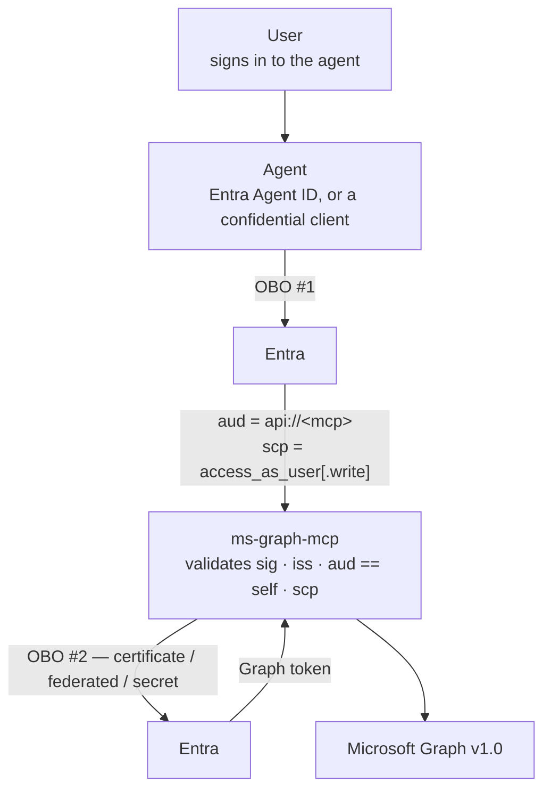

# Agent authentication

How an agent acting for a signed-in user calls this server, and what has to exist in Entra for it to
work. This is the hosted (Streamable HTTP) shape — a local stdio client signs the user in itself and
needs none of it.

## The shape

Two on-behalf-of exchanges, not one:



The agent exchanges the user's sign-in for a token **audienced to this server**. This server
validates that audience, then exchanges that token for a Microsoft Graph token using its own
credential. The user's Graph token is never passed around, and this server never sees a token it was
not the intended recipient of.

Entra supports chaining on-behalf-of with no published depth limit, but every hop must be a
confidential client acting for a user principal. App-only tokens into OBO and public clients as the
middle tier are both hard stops — this server rejects app-only at its own edge.

## What to configure in Entra

You need **two app registrations**: one for this server (the API), one for the agent (the client).
If you already run the server in passthrough mode with a single registration, the changes below are
what move you to the supported posture.

### 1. The MCP server's registration — expose an API

1. **Set an Application ID URI.** `api://<client-id>` is the default and is what this server derives
   when `GRAPH_MCP_AUDIENCE` is unset. A custom URI works too; set `GRAPH_MCP_AUDIENCE` to match.
2. **Expose delegated scopes** under *Expose an API*:
   - `access_as_user` — read access.
   - `access_as_user.write` — the write tier. Required in the token for any write tool; see
     [configuration.md](configuration.md#write-authority). Rename it with
     `GRAPH_MCP_WRITE_SCOPE_NAME` if you prefer a different convention.
3. **Grant the Microsoft Graph delegated permissions** the tools need, on this registration. The
   second exchange requests `https://graph.microsoft.com/.default`, which means "exactly what this
   registration is consented for" — so the resource owner bounds the surface, not the agent.
   [permissions.md](permissions.md) lists what each tool needs.
4. **Give it a client credential** — a certificate or a federated identity credential in production,
   a client secret only for development. See
   [configuration.md](configuration.md#client-credentials).

### 2. The agent's registration — request that API

1. Under *API permissions*, add the scopes you exposed above (`access_as_user`, and
   `access_as_user.write` only if the agent should be able to write).
2. Grant admin consent, or let the user consent on first use.

### Avoiding a second consent prompt

Left alone, the user consents twice: once to the agent, once to this server. Two ways to avoid that,
both on the **server's** registration:

- **`knownClientApplications`** — list the agent's client id in the server's manifest. Consent to
  the agent then covers the server's scopes in one prompt.
- **`preAuthorizedApplications`** — pre-authorize the agent for named scopes, so no consent is
  requested for them at all. The tighter of the two, since it is per-scope.

### Entra Agent ID

An agent with its own identity works the same way, with one difference worth knowing: the token
arriving here carries the **agent identity's** client id in `azp`, not the user's or the publishing
app's. Two consequences:

- `GRAPH_MCP_ALLOWED_AZP` can name exactly which agent identities may call this server. It is
  optional defence in depth — the audience is what proves the token was issued for this server — and
  empty by default, because switching it on without knowing the ids locks everyone out.
- With `InheritDelegatedPermissions`, an agent identity inherits the delegated permissions of its
  publishing application rather than needing its own grants, which is usually what you want when one
  application publishes several agents.

## Checking it works

```bash
# 1. The server publishes its metadata (needs GRAPH_MCP_RESOURCE_URL).
curl -s https://<host>/.well-known/oauth-protected-resource/mcp | jq

# 2. An unauthenticated call is refused, and says how to authenticate.
curl -si https://<host>/mcp -X POST | grep -i www-authenticate

# 3. A Graph-audienced token is refused — this is the posture working.
curl -si https://<host>/mcp -X POST -H "Authorization: Bearer <graph token>" | head -1
```

A correctly audienced token returns `200`. If it returns `401`, decode the token at
[jwt.ms](https://jwt.ms) and check `aud` first — it is the claim that has to match, and `azp` looking
right is what makes this confusing.

## Common failures

| Symptom | Cause |
|---|---|
| `401` with a correct-looking token | `aud` is Graph, not `api://<mcp client id>`. The agent requested the wrong resource. |
| `401` with `error="interaction_required"` and `claims` | Conditional Access wants a step-up. The client should acquire a new token satisfying the claims and retry — this is working as intended. |
| `403` with `error="insufficient_scope"` | The token lacks `access_as_user.write` and a write tool was called. Add the scope to the agent's permissions. |
| `502` from a tool call | The server's own credential was rejected. Check the certificate, federated credential or secret. |
| `AADSTS65001` | The user has not consented to the downstream Graph scopes on the server's registration. |
| Server will not start | `GRAPH_MCP_DOES_OBO` is on with no credential configured. The message names what is missing. |
