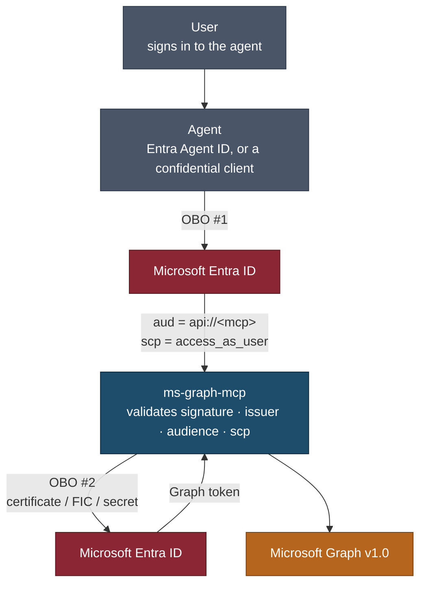

# Agents, tokens and the on-behalf-of chain

How an agent acting for a signed-in user reaches Microsoft Graph through this server, and what has
to be configured for it to work.

This is the **HTTP transport**. Running locally over stdio, the server signs you in through your own
browser and none of this applies — see the [README](../README.md#install).

## The shape



Two exchanges, and the user's identity is carried through both. The agent never holds a Graph token,
and this server never sees the user's original one.

**Why not just forward a Graph token?** Because a token minted for Graph was not issued for this
server, and the MCP authorization specification requires a server to reject tokens that were not
issued for it — that is the confused-deputy mitigation. Microsoft gives the same advice about
relaying middle-tier tokens, and names the consequence that bites hardest in a real tenant: a
relayed token **cannot satisfy Conditional Access claim step-up**. See
[ADR 0004](adr/0004-resource-server-by-default.md).

## What this server validates

Every request, before any tool runs:

| Check | Rejection |
|---|---|
| RS256 signature against the tenant's JWKS | `401` |
| Issuer matches the configured tenant (v1 and v2 forms) | `401` |
| **Audience is this server** — `api://<client-id>`, or `GRAPH_MCP_AUDIENCE` | `401` |
| Not an ID token (`nonce` present) | `401` |
| Not app-only — OBO works for user principals only | `403` |
| `azp` in `GRAPH_MCP_ALLOWED_AZP`, when set | `403` |
| `scp` contains `GRAPH_MCP_REQUIRED_SCOPE`, when set | `403` |

Audience validation runs even with `GRAPH_MCP_JWT_VERIFY=false`. That setting narrows *signature*
checking for a local run with no JWKS connectivity; it does not turn off the audience gate, which
needs no signing key and is the thing standing between this server and a token minted for something
else.

## Setting it up

### 1. Register the MCP as an API

App registration → **Expose an API**:

- Set the Application ID URI to `api://<client-id>` (the default).
- Add a scope `access_as_user`. Admin and user consent, enabled.
- Add a second scope `access_as_user.write` if you want write tools bound to a token claim rather
  than to a header — recommended, see [below](#binding-writes-to-the-token).

Then **API permissions** → Microsoft Graph → Delegated, and add what the agent should be able to
reach. [permissions.md](permissions.md) has the copy-paste consent sets. Grant admin consent so the
OBO exchange does not trip a consent prompt it has no way to show.

### 2. Give it a credential

The exchange needs a confidential-client credential. Precedence is **certificate → federated →
secret**, so a leftover secret cannot outrank a certificate you configured deliberately.

| Setting | Use |
|---|---|
| `GRAPH_MCP_CLIENT_CERT_PATH` | Production. A PEM bundle: `openssl pkcs12 -in file.pfx -out file.pem -nodes` |
| `GRAPH_MCP_FEDERATED_TOKEN_FILE` | AKS workload identity / managed identity. No secret at rest |
| `GRAPH_MCP_CLIENT_SECRET` | Development. Warns at startup |

Microsoft's Agent ID guidance is explicit that client secrets "shouldn't be used as client
credentials in production environments". On AKS with workload identity the projected token appears
at `/var/run/secrets/azure/tokens/azure-identity-token`; it is re-read on every exchange, so
rotation needs no restart.

**The server refuses to start** in resource-server mode with no credential, naming all three
options. That is deliberate — the alternative is an `obo_failed` mid-session on whatever tool the
model happened to call, a long way from the cause.

### 3. Let the agent get a token for it

The agent needs a token whose audience is `api://<mcp-client-id>` and whose `scp` includes
`access_as_user`. Two ways to avoid a second consent prompt:

- **Pre-authorization** — on the MCP registration, *Expose an API* → **Add a client application**,
  and list the agent's client id against the scopes. Nothing to consent to. Right when the callers
  are known.
- **Known client applications** — put the agent's client id in the MCP's `knownClientApplications`,
  and a single consent prompt covers both applications.

## Entra Agent ID

If the agent is an [Entra Agent ID](https://learn.microsoft.com/en-us/entra/agent-id/agent-on-behalf-of-oauth-flow)
rather than a classic app registration, the chain gains a hop but the shape here does not change.

An agent identity cannot start an interactive `/authorize` flow. It receives a user token from a
client, exchanges it against its **agent identity blueprint** (presenting the blueprint's credential
and an `fmi_path` naming the child identity), and only then performs the OBO exchange that produces
a token for this server. Supported grants are `client_credential`, `jwt-bearer` and `refresh_token`.

What matters here: the token this server receives carries the **agent identity's** client id in
`azp`, not the blueprint's. So if you pin callers with `GRAPH_MCP_ALLOWED_AZP`, list agent
identities — the blueprint's id never appears.

`InheritDelegatedPermissions` on the blueprint lets agent identities inherit its delegated
permissions, which is what keeps consent manageable when you run many instances. It applies only
with FIC impersonation and only within a tenant.

## Binding writes to the token

By default the write tier is gated by `X-Write-Scope: true` — a header the caller sets for itself.
That is a *preference*, not authority.

Set `GRAPH_MCP_WRITE_SCOPE_NAME=access_as_user.write` and the token decides instead:

```
write access = X-Write-Scope: true  AND  access_as_user.write present in scp
```

The header can then only narrow. An agent that was never granted the write scope cannot reach
`mail_send` however it sets its headers. Leave it unset and the previous header-only behaviour
applies, with Graph's own consent as the sole backstop — which is a boundary in the wrong place.

Likewise `GRAPH_MCP_REQUIRED_SCOPE=access_as_user` gates the whole surface. Both default to empty
today; [deprecations.py](../src/ms_graph_mcp/deprecations.py) records that they become non-empty in
0.5.0.

## Conditional Access and step-up

When Entra refuses the exchange because a policy needs satisfying — MFA, sign-in frequency, a
compliant device — it returns a **claims challenge**. This server answers:

```http
HTTP/1.1 401 Unauthorized
WWW-Authenticate: Bearer resource_metadata="…", error="interaction_required", claims="<base64url>"
```

The client is expected to acquire a new token presenting those claims, and retry. Retrying with the
cached token will fail identically.

A configuration fault — a bad secret, a missing permission — is a `500` instead, deliberately: a
`401` would send the client into a re-authorization loop against something no token can fix.

## The passthrough posture

`GRAPH_MCP_DOES_OBO=false` restores the old behaviour: the caller forwards a Graph token it already
exchanged, validated by Graph audience plus `azp`. It is **deprecated**, removal in 1.0, and warns
at startup.

It exists because the platform this server was extracted from runs it, and migrating needs an app
registration change that cannot be done in a deploy. If you are starting fresh, do not use it.

## Troubleshooting

| Symptom | Cause |
|---|---|
| `401`, audience mismatch | The caller requested a token for Graph, or for another API. It must request `api://<mcp-client-id>`. |
| `403`, missing required scope | The token's `scp` lacks `GRAPH_MCP_REQUIRED_SCOPE`. Check the scope is exposed *and* consented. |
| `403`, app-only tokens not permitted | A client-credentials token was presented. OBO works only for user principals — use the machine shared secret and the internal tier instead. |
| `500`, `AADSTS7000215` | Invalid client secret on the MCP registration. |
| `500`, `AADSTS65001` | Admin consent was never granted for the Graph permissions the MCP requests. |
| `401` with `claims` | Working as intended — Conditional Access wants step-up. The client must re-authorize. |
| Write tools refused despite `X-Write-Scope: true` | `GRAPH_MCP_WRITE_SCOPE_NAME` is set and the token lacks that scope. This is the gate doing its job. |

Raise `GRAPH_MCP_LOG_LEVEL=INFO` to see the exchange and each Graph call. Tokens are never logged;
the correlation id from a failed exchange is, and it is what Microsoft support will ask for.

## See also

- [configuration.md](configuration.md) — every setting
- [hosting.md](hosting.md) — running the HTTP transport
- [ADR 0004](adr/0004-resource-server-by-default.md) — why this is the default
- [ADR 0003](adr/0003-no-gateway-trust-mode.md) — why validation always runs in-server
