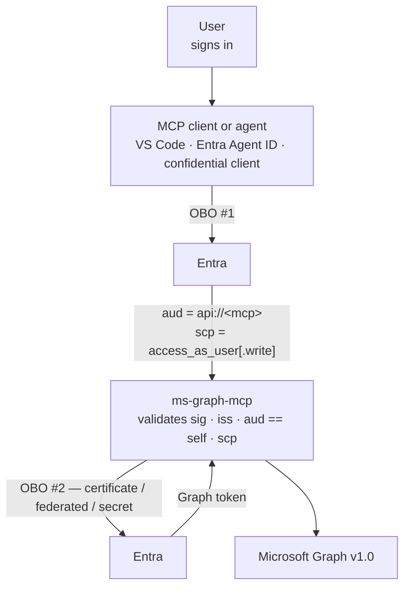

# Authentication guide

How callers authenticate to a hosted `ms-graph-mcp`, what changed in 0.4.0 and why, and the exact
Entra configuration for the two shapes people actually deploy:

- **[Scenario A](#scenario-a--an-mcp-client-connects-directly)** — an MCP client connects directly:
  VS Code, MCP Inspector, or another editor that speaks Streamable HTTP.
- **[Scenario B](#scenario-b--a-custom-agent-calls-on-a-users-behalf)** — your own agent calls the
  server on a signed-in user's behalf, including Entra Agent ID.

Running locally over stdio needs none of this — see [configuration.md](configuration.md#running-locally-stdio--you-are-the-user).

---

## Why this changed

Until 0.4.0 the default was **token passthrough**: the caller obtained a token for *Microsoft Graph*
and forwarded it, and this server used it against Graph directly. The token was validated —
signature, issuer, expiry — and narrowed by checking that `azp` matched this app's client id.

That is not the same as the token being *for* this server:

- `aud` says which resource a token was issued to. A Graph token says `https://graph.microsoft.com`.
- `azp` says which application asked for it. It says nothing about who may spend it.

So any application that could obtain a Graph token through this registration could spend it against
the whole tool surface. The [MCP authorization specification](https://modelcontextprotocol.io/docs/tutorials/security/authorization)
names this as token passthrough, requires a server to validate that a token was issued specifically
for it, and calls audience validation the confused-deputy mitigation.
[Microsoft's OBO documentation](https://learn.microsoft.com/en-us/entra/identity-platform/v2-oauth2-on-behalf-of-flow)
says the same from the other side: "**DO NOT** send access tokens that were issued to the middle
tier to anywhere except the intended audience."

Three things follow, and only the first is about specification compliance:

1. **A token issued for something else is now refused.**
2. **Conditional Access step-up can complete.** Microsoft lists "inability to satisfy … Conditional
   Access scenarios requiring claim step-up (for example, MFA, Sign-in Frequency)" as a direct
   consequence of passthrough. That was live here: `AADSTS53003` is in this repo's own
   [troubleshooting](troubleshooting.md) as something users hit, and the claims challenge that
   resolves it had nowhere to go — it was being flattened into a tool result inside an HTTP 200,
   which no client acts on. It now returns as a `401` with `WWW-Authenticate`.
3. **Delegated scopes became meaningful.** In a token audienced to this server, `scp` describes what
   the user authorized *this server* to do. That is what lets the write tier be gated on
   `access_as_user.write` instead of on `X-Write-Scope: true` — a header any caller can set for
   itself, and therefore never authority. See [ADR 0004](adr/0004-resource-server-by-default.md).

### What you have to change

**Two app registrations**, where passthrough needed one:

| | Registration | Purpose |
|---|---|---|
| **API** | this server | Exposes `access_as_user` / `access_as_user.write`, holds the Graph delegated permissions, and owns the client credential used for the second exchange |
| **Client** | VS Code, or your agent | Requests those scopes on the user's behalf |

Existing deployments are not forced to move immediately: `GRAPH_MCP_DOES_OBO=false` keeps the old
behaviour, warns at startup, and is supported until 1.0.0.

---

## The flow

Two on-behalf-of exchanges, not one:



The user's Graph token is never handed around, and this server never receives a token it was not the
intended recipient of. Entra supports chaining on-behalf-of with no published depth limit, but every
hop must be a confidential client acting for a user principal — app-only tokens into OBO and public
clients as the middle tier are both hard stops, and this server rejects app-only at its own edge.

---

## Step 1 — The server's app registration (both scenarios)

1. **Set an Application ID URI.** *Expose an API* → *Application ID URI*. `api://<client-id>` is the
   default and is what this server derives when `GRAPH_MCP_AUDIENCE` is unset. A custom URI works;
   set `GRAPH_MCP_AUDIENCE` to match.
2. **Expose two delegated scopes:**
   - `access_as_user` — the read tier.
   - `access_as_user.write` — the write tier. Required in `scp` for any write tool.

   Rename either with `GRAPH_MCP_READ_SCOPE_NAME` / `GRAPH_MCP_WRITE_SCOPE_NAME`.
3. **Add the Microsoft Graph delegated permissions** the tools need, on *this* registration. The
   second exchange requests `https://graph.microsoft.com/.default`, which means "exactly what this
   registration is consented for" — so the resource owner bounds the surface, not the caller.
   [permissions.md](permissions.md) lists what each tool needs.
4. **Give it a client credential.** Certificate or federated identity credential in production, a
   client secret only for development — see
   [Client credentials](configuration.md#client-credentials). The server refuses to start without
   one.
5. **Publish discovery:** set `GRAPH_MCP_RESOURCE_URL` to the server's public URL. Without it there
   is no `/.well-known/oauth-protected-resource` document, and a client has no way to discover how
   to authenticate.

Server-side configuration, minimally:

```bash
GRAPH_MCP_TENANT_ID=<directory-tenant-id>
GRAPH_MCP_CLIENT_ID=<this-server's-application-client-id>
GRAPH_MCP_CLIENT_CERT_PATH=/etc/ms-graph-mcp/cert.pem   # or a federated token file
GRAPH_MCP_RESOURCE_URL=https://graph-mcp.example.com/mcp
# GRAPH_MCP_DOES_OBO=true is the default — no need to set it
```

> **Check what you are advertising.** The metadata document must name *this server's* scopes, not
> Graph's, because a client reads it to decide what to request:
>
> ```bash
> curl -s https://graph-mcp.example.com/.well-known/oauth-protected-resource/mcp | jq .scopes_supported
> # ["api://<client-id>/access_as_user", "api://<client-id>/access_as_user.write"]
> ```

---

## Scenario A — An MCP client connects directly

VS Code, MCP Inspector, or any spec-compliant client speaking Streamable HTTP. The client does the
OAuth dance itself; there is no agent in the middle and no second registration to create, because
the client is already registered.

### The problem this scenario runs into

The MCP specification expects a client that has no registration to obtain one through **dynamic
client registration** (RFC 7591). **Microsoft Entra ID does not implement it** — there is no
registration endpoint to call. So a client cannot register itself, and something has to supply a
client id that already exists in the tenant.

Two ways out, and the first is what VS Code uses:

- **Pre-authorization.** The client is an application already registered in the tenant — VS Code is
  a first-party Microsoft application, so it exists everywhere — and you authorize it against the
  scope you exposed.
- **Your own client registration**, configured into the client by id, for clients that let you set
  one.

### Which clients this works with today

The gap above is not evenly distributed, and it decides whether a given client can connect at all.

| Client | Remote HTTP against Entra | Notes |
|---|---|---|
| **VS Code** | **Works** | Reads the metadata document, opens a browser for SSO, sends the token. Pre-authorize its client id, below. |
| **MCP Inspector** | Works | Same discovery path; supply a client id you registered. |
| **Claude Code / Claude Desktop** | **Not today** | They perform dynamic client registration as the first step of the OAuth flow, [even when a client id is configured](https://github.com/anthropics/claude-code/issues/26675). Entra has no registration endpoint, so the flow cannot start. |
| **Any client over stdio** | Works | A local client signs the user in interactively and holds a Graph token; none of this applies. |

This is not specific to this server. Microsoft's own Azure DevOps remote MCP server has the same
limitation, and Microsoft has said it is working with the Entra team on dynamic client registration
or Client ID Metadata Documents without publishing a date.

If you need Claude Code today, the two honest options are:

- **Run it over stdio**, which already does interactive Microsoft 365 SSO and is the supported path
  for local clients — see the README's client configuration section.
- **Put an OAuth proxy in front** that implements a registration endpoint and brokers to Entra. That
  is a component you would own; this server does not provide one, and adding one means holding the
  authorization-code exchange yourself.

### Authorize the client on your API

In the **server's** app registration → *Expose an API* → **Authorized client applications** → *Add a
client application*:

| Client | Client ID |
|---|---|
| Visual Studio Code | `aebc6443-996d-45c2-90f0-388ff96faa56` |

Tick `access_as_user` (and `access_as_user.write` if that client should be able to write), then add.
This is the `preAuthorizedApplications` collection in the manifest: the client may request those
scopes with **no consent prompt at all**.

For a client that is not pre-registered, create a client app registration of your own — *Mobile and
desktop applications* platform, with the redirect URI that client documents — grant it the scopes
under *API permissions*, and give the client its id.

### Configure VS Code

Remote HTTP server in `.vscode/mcp.json` (workspace) or your user configuration:

```jsonc
{
  "servers": {
    "ms-graph": {
      "type": "http",
      "url": "https://graph-mcp.example.com/mcp",
      "oauth": {
        // Omit when the client is pre-authorized as above; set it to use your
        // own client registration instead.
        "clientId": "<your-client-app-registration-id>"
      }
    }
  }
}
```

Reload, then **MCP: List Servers** → *Start Server*. VS Code reads the protected-resource metadata,
discovers the authorization server and the scope, opens a browser for normal Microsoft 365 sign-in
(MFA and Conditional Access included), and sends the resulting token as `Authorization: Bearer`.

Switch the Chat view to **Agent** mode and the tools appear in the tools picker.

> **If VS Code prompts you to authenticate against `https://<your-host>/authorize`**, discovery
> failed — it fell back to guessing your server is the authorization server. Check
> `GRAPH_MCP_RESOURCE_URL` is set and that the metadata document is reachable unauthenticated.

### Turning on write tools for an editor

Two things, because either alone is deliberately not enough:

1. The token must carry `access_as_user.write` — tick it in *Authorized client applications*, or add
   it to the client registration's API permissions.
2. The request must opt in with `X-Write-Scope: true`:

```jsonc
"headers": { "X-Write-Scope": "true" }
```

Calling a write tool without the scope returns `403` with
`WWW-Authenticate: Bearer error="insufficient_scope", scope="api://<client-id>/access_as_user.write"`,
which a conforming client uses to re-authorize and retry.

---

## Scenario B — A custom agent calls on a user's behalf

Your own hosted agent — a web app, an API, an Entra Agent ID agent — already signed the user in, and
calls this server as part of serving a request.

### What the agent does

1. Sign the user in as normal, acquiring a token for *the agent's own* API or client.
2. Exchange it on-behalf-of for a token whose **resource is this server**, requesting
   `api://<mcp-client-id>/access_as_user` (plus `.write` if it will call write tools). That is OBO #1
   in the diagram.
3. Send that token as `Authorization: Bearer`, plus `X-Write-Scope: true` when writing.

```http
POST /mcp HTTP/1.1
Host: graph-mcp.example.com
Authorization: Bearer <token audienced to api://mcp-client-id>
X-Write-Scope: true
Content-Type: application/json
```

The agent must be a **confidential client** with a credential of its own. Entra refuses on-behalf-of
for a public client in the middle tier.

### The agent's app registration

1. *API permissions* → *My APIs* → this server's registration → add `access_as_user`, and
   `access_as_user.write` only if the agent should be able to write. Grant admin consent, or let the
   user consent on first use.
2. Give it a credential — certificate or federated identity credential, same guidance as the server.

### Avoiding a second consent prompt

Left alone, the user consents twice: once to your agent, once to this server. Both fixes live on the
**server's** registration, and they are not the same thing:

| | What it does | When to use it |
|---|---|---|
| **`knownClientApplications`** | Lists the client's app id, so consent to the *client* also covers this API's scopes, in a single combined prompt | Your own client and API published together — the user still consents, once |
| **`preAuthorizedApplications`** | Pre-authorizes a named client for named scopes, so **no consent is requested for them at all** | A client you control and trust; also what the VS Code entry above uses |

`preAuthorizedApplications` is the tighter of the two because it is per-scope: you can pre-authorize
a client for `access_as_user` while still requiring explicit consent for `access_as_user.write`.

### Entra Agent ID

An agent with its own identity works the same way, with one difference worth knowing: the token
arriving here carries the **agent identity's** client id in `azp`, not the user's and not the
publishing application's. Two consequences:

- **`GRAPH_MCP_ALLOWED_AZP`** can name exactly which agent identities may call this server:

  ```bash
  GRAPH_MCP_ALLOWED_AZP=<agent-identity-client-id>,<another-agent-id>
  ```

  It is optional defence in depth, not the gate — the audience is what proves a token was issued for
  this server. Empty by default, because switching it on without knowing the ids locks everyone out.
  And it does not substitute for audience validation: a Graph-audienced token is still refused even
  when its `azp` is on the list.
- **`InheritDelegatedPermissions`** lets an agent identity inherit its publishing application's
  delegated permissions instead of needing its own grants, which is usually what you want when one
  application publishes several agents.

### There must be a user somewhere

On-behalf-of exchanges *a user's* token. The agent needs no interactive login **at this server** —
the user signed into your application, and the agent trades that for a token audienced here — but
there has to have been a sign-in at some point, and the agent has to be holding a token for that
user.

A genuinely userless agent — a daemon, a scheduled job, anything with no signed-in person behind the
request — cannot use this path. An app-only (client-credentials) token is refused at the edge with
`403 app_only_denied`, deliberately: app-only Graph permissions are tenant-wide, so an app-only
`Mail.Read` reads *every* mailbox in the tenant, which is not a thing to enable by accident. The
supported userless path today is the shared-secret machine principal and the internal tier, which is
a deliberately small surface — see [hosting.md](hosting.md).

### Machine-to-machine calls

A first-party service calling this server as itself, with no user, uses the shared secret
(`GRAPH_MCP_SHARED_SECRET`) and the internal tier rather than any of the above. That path is
unchanged, and is described in [hosting.md](hosting.md).

---

## Checking it works

```bash
# 1. The metadata document is served, unauthenticated, and names your scopes.
curl -s https://<host>/.well-known/oauth-protected-resource/mcp | jq

# 2. An unauthenticated call is refused and says how to authenticate.
curl -si https://<host>/mcp -X POST | grep -i www-authenticate

# 3. A Graph-audienced token is refused. This is the posture working, not a bug.
curl -si https://<host>/mcp -X POST -H "Authorization: Bearer <a graph token>" | head -1
```

A correctly audienced token returns `200`. If it returns `401`, decode the token at
[jwt.ms](https://jwt.ms) and check **`aud` first** — it is the claim that has to match, and `azp`
looking right is exactly what makes this confusing.

## Common failures

| Symptom | Cause |
|---|---|
| `401` with a correct-looking token | `aud` is Graph, not `api://<mcp client id>`. The caller requested the wrong resource. |
| VS Code prompts to sign in at `https://<host>/authorize` | Discovery failed — `GRAPH_MCP_RESOURCE_URL` is unset, so there is no metadata document and the client guessed. |
| `401` with `error="interaction_required"` and `claims` | Conditional Access wants a step-up. The client should satisfy the claims challenge and retry — this is the flow working. |
| `403` with `error="insufficient_scope"` | A write tool without `access_as_user.write` in the token. |
| `502` from a tool call | This server's own client credential was rejected by Entra. |
| `AADSTS65001` | The user has not consented to the downstream Graph permissions on the *server's* registration. |
| `AADSTS50013` on the exchange | The agent is a public client, or its assertion was issued for the wrong resource. On-behalf-of needs a confidential client holding a token for this API. |
| Server will not start | `GRAPH_MCP_DOES_OBO` is on (the default) with no credential configured. The startup message names what is missing. |

## References

- [MCP authorization specification](https://modelcontextprotocol.io/docs/tutorials/security/authorization)
- [OAuth 2.0 On-Behalf-Of flow](https://learn.microsoft.com/en-us/entra/identity-platform/v2-oauth2-on-behalf-of-flow)
- [Agent OAuth flows: on-behalf-of — Entra Agent ID](https://learn.microsoft.com/en-us/entra/agent-id/agent-on-behalf-of-oauth-flow)
- [Secure MCP servers with Microsoft Entra authentication](https://learn.microsoft.com/en-us/azure/app-service/configure-authentication-mcp-server-vscode)
  — the source of the VS Code client id and the authorized-client-application step
- [VS Code MCP configuration reference](https://code.visualstudio.com/docs/agents/reference/mcp-configuration)
- [ADR 0004](adr/0004-resource-server-by-default.md) — the decision and what it costs
